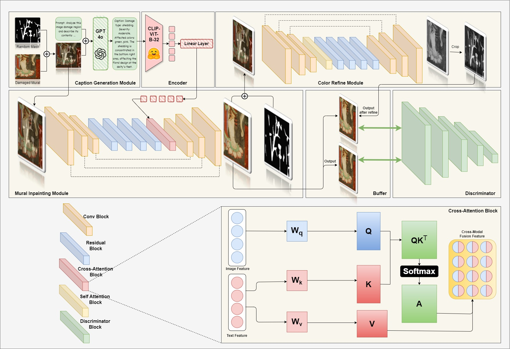

# MuralXConv

## System Architecture
### Overview

### Caption Generation Module
In the Damage Detection \& Description Generation module, we employ BLIP-2, a vision-language model, to analyze input images and generate damage-aware textual descriptions. Given a damaged mural image from the MuralDH dataset, BLIP-2 processes visual features to identify missing or deteriorated regions and formulates a structured textual representation of the damage. The model captures fine-grained details such as the extent of cracks, the loss of specific artistic elements, and degradation patterns. For instance, a generated description might state: "The central figure's face is partially missing, with damage to the left eye and nose. The surrounding floral patterns are faded, and cracks extend across the top right corner." By explicitly outlining damaged regions, this text serves as essential guidance for the inpainting process, allowing the restoration model to reconstruct missing details with greater contextual awareness.  
### Mural Inpainting Module
The Text-Guided Image Inpainting module utilizes a convolutional neural network (CNN) as generator, that synthesizes missing mural elements based on both visual and linguistic inputs. Inspired by, given the excellence of text guidance in the field of image inpainting. The model takes as input the damaged image alongside the textual damage description and integrates them to infer the missing content. To integrate textual guidance into the visual restoration process, we employ CLIP (Contrastive Language-Image Pretraining) to encode the input text into a semantic feature representation. A linear projection layer is then utilized to map the extracted textual features into the CNN feature space, enabling effective fusion of linguistic information with spatial image features. This approach ensures that the generated content accurately reconstructs the missing details while preserving semantic consistency.
### Color Recorrection Module
However, these efforts were not sufficient, as we observed that while the generated missing parts aligned well with the original artwork in terms of content, they still exhibited noticeable deviations in color. Therefore, a color correction network refines the output by adjusting the restored region’s texture, tone, and pigment distribution, ensuring a seamless blend with the undamaged portions of the mural. This additional refinement step is crucial for maintaining the mural’s artistic consistency and historical authenticity, preventing color mismatches or stylistic deviations that could arise from pure data-driven inpainting
### Discriminator Module

## Reference
